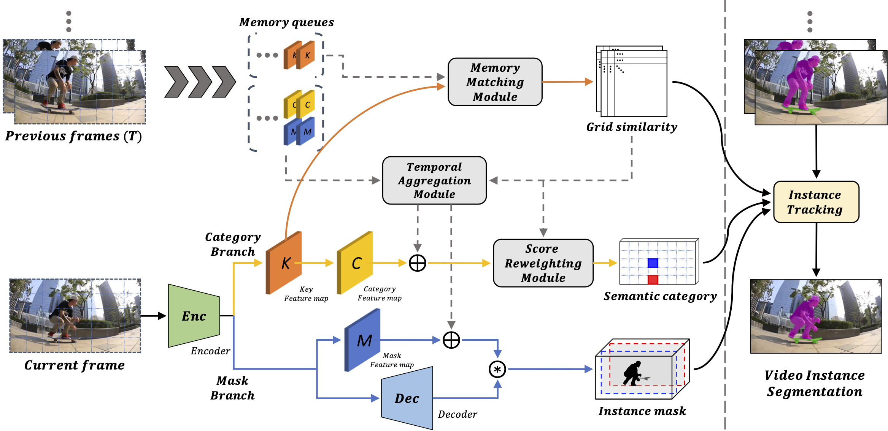

# VISOLO: Grid-Based Space-Time Aggregation for Efficient Online Video Instance Segmentation

<div align="center">
  
</div>

## Paper
[VISOLO: Grid-Based Space-Time Aggregation for Efficient Online Video Instance Segmentation](https://arxiv.org/abs/2112.04177)

### Note
* Based on [detectron2](https://github.com/facebookresearch/detectron2).
* The codes are under [projects/](projects/) folder, which follows the convention of detectron2.
* You can easily import our project to the latest detectron2 by following below.
    - inserting [projects/VISOLO](projects/VISOLO) folder
    - updating [detectron2/projects/__init\_\_.py](detectron2/projects/__init__.py)
    - updating [setup.py](./setup.py)
    
### Steps

1. Installation.
* Run a docker container and install the repository.
* Compile a docker image following [docker/README.md](docker/README.md).
* On top of the docker container, install the repository by the following command.
```bash
git clone https://github.com/SuHoHan95/VISOLO.git
cd VISOLO
pip install -e .
pip install -r requirements.txt
pip install git+https://github.com/youtubevos/cocoapi.git#"egg=pycocotools&subdirectory=PythonAPI"
```

2. Link datasets

COCO

Download the json file([coco_to_ytvis2019.json](https://drive.google.com/file/d/17L33_woQh7eUMemCmnFDOgPUKi-2fTW0/view?usp=sharing))
```bash
cp coco_to_ytvis2019.json /path_to_coco_dataset/annotations
cd projects/VISOLO
mkdir -p datasets/coco
ln -s /path_to_coco_dataset/annotations datasets/coco/annotations
ln -s /path_to_coco_dataset/train2017 datasets/coco/train2017
ln -s /path_to_coco_dataset/val2017 datasets/coco/val2017
```

YTVIS 2019
```bash
mkdir -p datasets/ytvis_2019
ln -s /path_to_ytvis_2019_dataset/* datasets/ytvis_2019
```
we expect ytvis_2019 folder to be like
```
└── ytvis_2019
    ├── train
    │   ├── Annotations
    │   ├── JPEGImages
    │   └── meta.json
    ├── valid
    │   ├── Annotations
    │   ├── JPEGImages
    │   └── meta.json
    ├── test
    │   ├── Annotations
    │   ├── JPEGImages
    │   └── meta.json
    ├── train.json
    ├── valid.json
    └── test.json
```

3. Training.

* Training using 4 GPUS(TESLA V100-PCIE-32GB)
* Pre-training on COCO dataset
```bash
python train_net.py --num-gpus 4 --config-file ./configs/base_coco.yaml OUTPUT_DIR ./checkpoint/coco/
```
* Fine-tuning on YTVIS2019 with pre-trained weights on COCO dataset ([r50_coco.pth](https://drive.google.com/file/d/1rb3i9MBtAjh3SJ2AWdgb3PvuPpF8Swpi/view?usp=sharing))
```bash
python train_net.py --num-gpus 4 --config-file ./configs/base_ytvis_coco.yaml OUTPUT_DIR ./checkpoint/ytvis_2019/ MODEL.WEIGHTS path/to/pre-trained-model.pth
```

4. Evaluating.

Evaluating on YTVIS 2019
```bash
python train_net.py --eval-only --num-gpus 1 --config-file ./configs/base_ytvis_coco.yaml OUTPUT_DIR ./checkpoint/ytvis_2019/ MODEL.WEIGHTS path/to/model.pth
```
"results.json" saved in OUTPUT_DIR/inference/

## Model Checkpoints (YTVIS 2019)
Due to the small size of YTVIS dataset, the scores may fluctuate even if retrained with the same configuration.

**Note:** The provided checkpoints are the ones with *highest* accuracy from multiple training attempts.

| backbone  |  FPS |  AP  | AP50 | AP75 |  AR1 |  AR10 | download |
|:----------|:----:|:----:|:----:|:----:|:----:|:-----:|:--------:|
| [ResNet-50](projects/VISOLO/configs/base_ytvis_coco.yaml) | 40.0 | 38.6 | 56.3 | 43.7 | 35.7 | 42.5 | [model](https://drive.google.com/file/d/1kgr2WPXB1rv8U4aaE1FKjPNezCDzqMY3/view?usp=sharing) |

## Video Comparisons
The overall flow of our VISOLO and the comparison of different VIS methods on the YouTube-VIS 2019 dataset are provided at https://youtu.be/j33H7vcJ2uU

## License

VISOLO is released under the [Apache 2.0 license](LICENSE).

This code is for non-commercial use only.

## Citing

If our work is useful in your project, please consider citing us.

```BibTex
@inproceedings{han2022visolo,
  title={VISOLO: Grid-Based Space-Time Aggregation for Efficient Online Video Instance Segmentation},
  author={Han, Su Ho and Hwang, Sukjun and Oh, Seoung Wug and Park, Yeonchool and Kim, Hyunwoo and Kim, Min-Jung and Kim, Seon Joo},
  booktitle =  {Proceedings of the IEEE/CVF Conference on Computer Vision and Pattern Recognition (CVPR)},
  year={2022}
}
```

## Acknowledgement
We highly appreciate all previous works that influenced our project.\
Special thanks to facebookresearch and IFC authors for their wonderful codes that have been publicly released ([detectron2](https://github.com/facebookresearch/detectron2), [IFC](https://github.com/sukjunhwang/IFC)).
